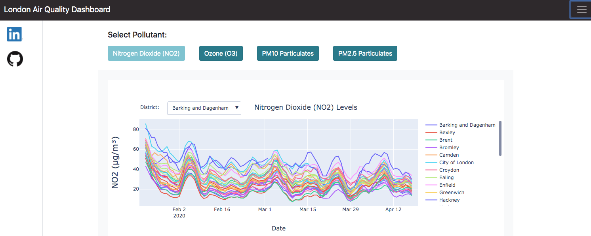

# LondonAir-Covid-Dashboard
Dashboard investigating air pollution in London around Covid lockdown deployed using Flask

## Table of Contents
[1. Installation and Data](#installation-and-data) \
[2. Project Motivation](#project-motivation) \
[3. File Descriptions](#file-descriptions) \
[4. Results](#results) \
[5. Licensing, Authors, and Acknowledgements](#licensing) 

## Dashboard access and data
To run the code deploying the dashboard on a local machine, requires Python versions 3.\*. Requirements are listed in the `requirements.txt` file. 
You can view the deployed dashboard [here](https://london-air-covid-webapp.herokuapp.com/). 
\
The data was obtained using the [LondonAir API](https://www.londonair.org.uk/LondonAir/API/), thanks to researchers at King's College London.

## Project Motivation
For this project, I was interested in visualising available air quality data in London around the time of the Covid-19 lockdown in the UK. The dashboard focuses on visualising the trends and changes in four main air pollutants: NO2, O3, PM10 and PM2.5 particulates. 

## File Descriptions
The routes python file and HTML for creating the dashboard are located in the `myapp` folder, while data wrangling and plot creation scripts are located in the `wrangling_scripts` folder. The data, obtained from the API, is located in the `data` folder, though I would like to alter this and request the APIs directly (so this may change soon).

## Licensing, Authors, Acknowledgements 
I give credit to LondonAir for making the data available [here](http://api.erg.kcl.ac.uk/AirQuality/help). The data is available under [the open government license](http://www.nationalarchives.gov.uk/doc/open-government-licence/version/2/).
The app and `data` folder contains public sector information licensed under the Open Government Licence v2.0.
